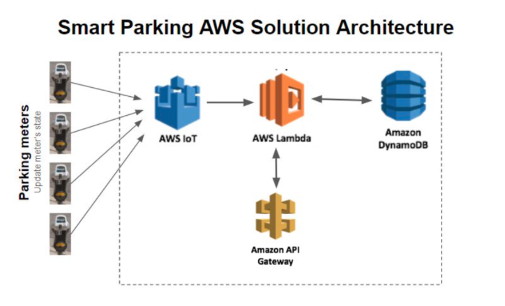
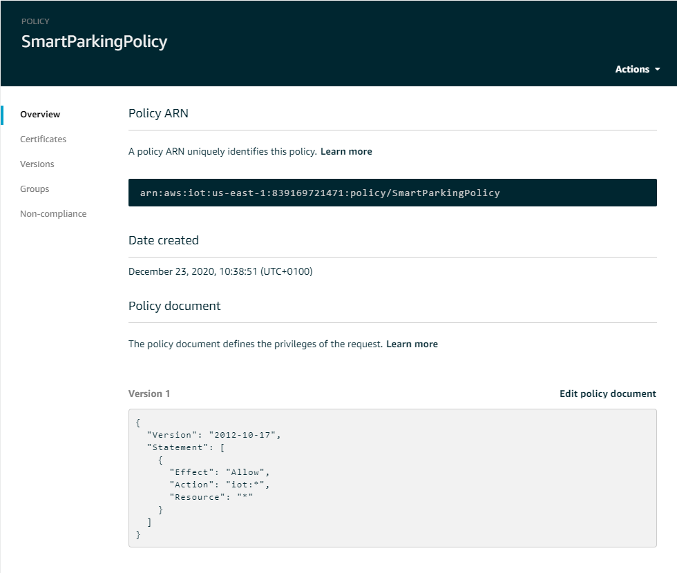
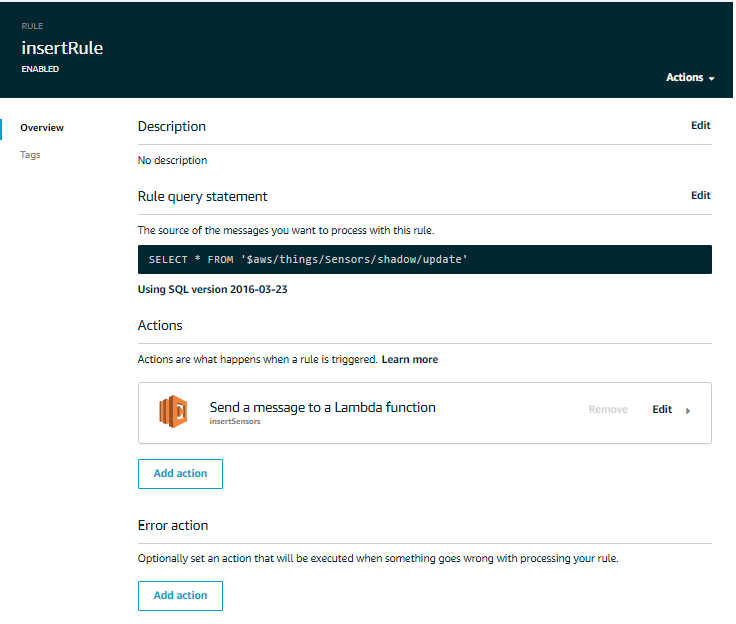
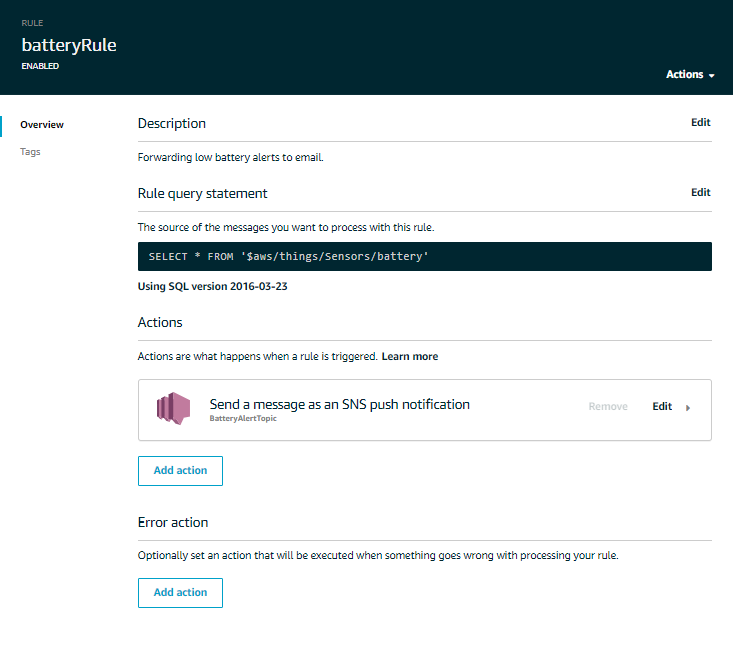
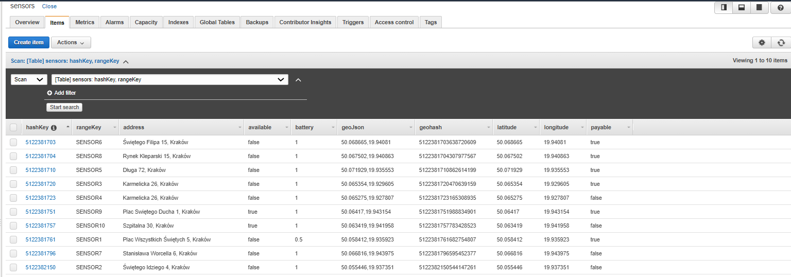
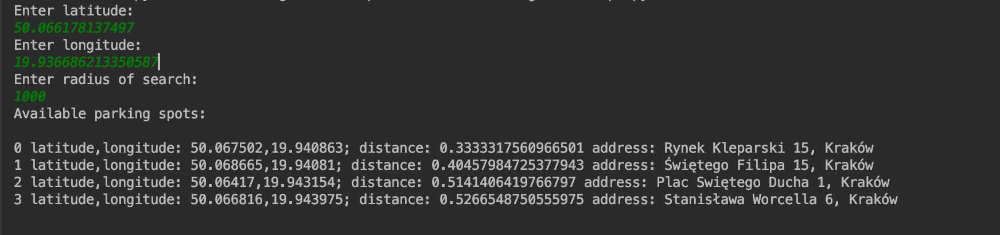
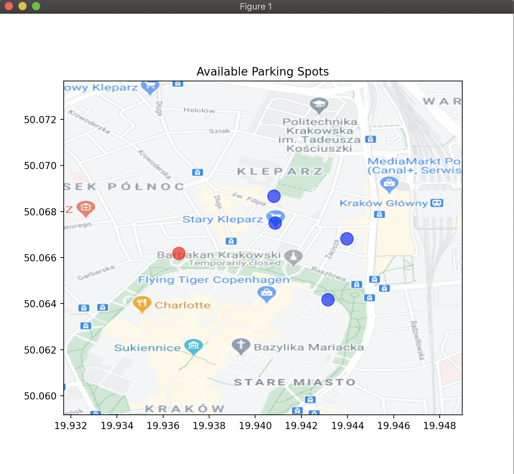

# SmartParking
A project created for IoT class at AGH University of Science and Technology. It emulates the basic workings of a smart parking system, giving users the ability to discover available parking spots closest to their current location. 

Authors:
- Izabela Czajowska
- Jerzy Jędrzejaszek
- Agata Nowara
- Kinga Wierchomska

## Description

Technology-wise the project is based on Amazon's web services, specifically API Gateway, DynamoDB, Lambda, the IoT Core and SNS. To aid with the specifics of the topic we used an extension library for DynamoDB used for managing geographic position data. The scripts representing the client app and IoT devices are written in Python.

## Architecture schema
 <br>
## IoT Core
AWS IoT Core provides secure, bi-directional communication for Internet-connected devices (such as sensors) to connect to the AWS Cloud over MQTT, HTTPS.
#### Sensors
For the purposes of non-trivial simulatino we have created 10 simulated sensors, each of them represented as Thing in IoT Core. Each of them is provided with the same policy, as they are nearly identical.
 <br>
 <br>

The [GenericSensor](Sensors/GenericSensor.py) class imitates a real device which:
- connects to the service
- publishes to the **$aws/things/Sensors/shadow/update** topic, sending the following data:
```json
{"state": {
                "reported": {
                    "deviceID": self.deviceID,
                    "latitude": self.latitude,
                    "longitude": self.longitude,
                    "available": available,
                    "time": str(datetime.datetime.now()),
                    "battery": self.battery,
                    "address": self.address,
                    "payable": self.payable
                }
}}
```
- publishes to the **$aws/things/Sensors/battery** topic, sending information about battery level

To quickly summarize, once turned on the device will begin periodically sending MQTT messages to IoT Core with updates on its current status.

#### Rules

The rules govern interaction with AWS Services. For this project we created two of them:
- the insertRule, which triggers the Lambda function responsible for inserting information into DynamoDB and updating present records
 <br>
  
- the batteryRule, which detects whether a sensor's battery level is below 20%, and if so sends an SNS push notification to the administrator email
 <br>
  
## DynamoDB
DynamoDB is a fully managed proprietary NoSQL database. Using the Geo Library for Amazon DynamoDB (dynamodbgeo) library we were able to make geospatial data manipulation and querying much more efficient.
All information sent from sensors is stored and updated in this database.
 <br>

## Simple Notification Service
Amazon's Simple Notification Service (SNS) is a web service that coordinates and manages the delivery or sending of messages to subscribing endpoints or clients. As previously mentioned, we use it for notifying the admin about low battery levels in sensors by sending an email.


## API Gateway
API Gateway provides tools for creating and documenting web APIs that route HTTP requests to Lambda functions.
We use this service to query the database for unoccupied parking spots from the client app.
Upon recieving a request, the API Gateway forwards it to an appropriate Lambda handler, waits for a result from the function, then relays said result to the caller.

  
## Lambda
AWS Lambda is a computing service that runs code in response to events and automatically manages the computing resources required by that code.

In our project, messages sent by the sensors are forwarded to Lambda, where a dedicated handler function [updateHandler](updateHandler.py) updates the device's status in the database. If the device is connecting for the first time, the function will create a corresponding entry in the database.

Eventually, an instance of the client app ([userScript](userScript.py)) will make a request to find nearby parking spaces. This occurs via HTTP. The request is received by the API Gateway and forwarded to the [findParkingSpaces](findParkingSpaces.py) handler function. This function conducts the search based on client-specified parameters and replies with a set of spots that match the criteria. These are then sent back to the client as JSON in a HTTP response.

## IAM
AWS Identity and Access Management (IAM) helps define what a principal entity (person or application) is allowed to do in an account.
Access can be managed in AWS by creating policies and attaching them to IAM identities (users, groups of users, or roles) or AWS resources.
It was necessary for us to use this service in order to give the Lambda functions full access to DynamoDB, as well as to enable Cloud Watch logs.


## Presentation

To visualize the functioning of our application we prepared a high resolution image, a part of Google Maps, presenting the city center of Cracow. 
On this map we display the position of the user based on given coordinates, as well as show available parking spots within the specified radius.

### User program
The input arguments of our program are the users latitude and longitude, as well as the radius of search. Based on the given data, the program sends a request to the database and receives a JSON structure containing the list of available parking places. <br>
 <br>

### Visualisation
 <br>


